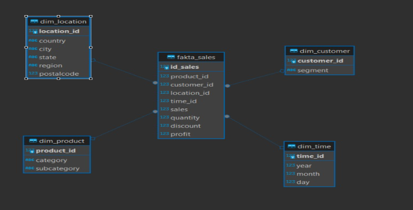
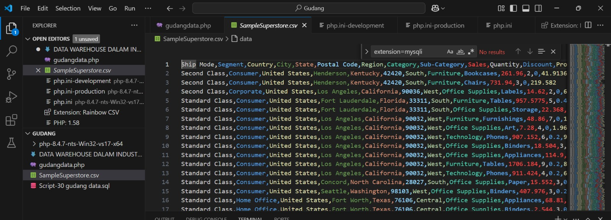
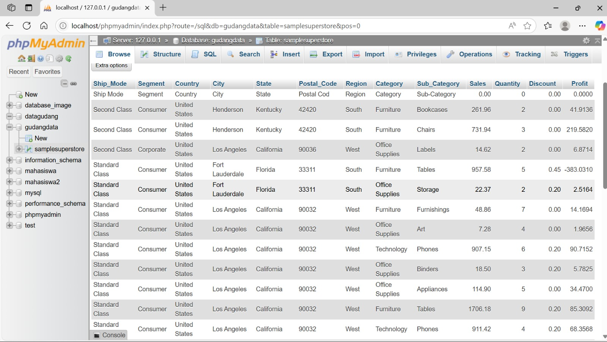
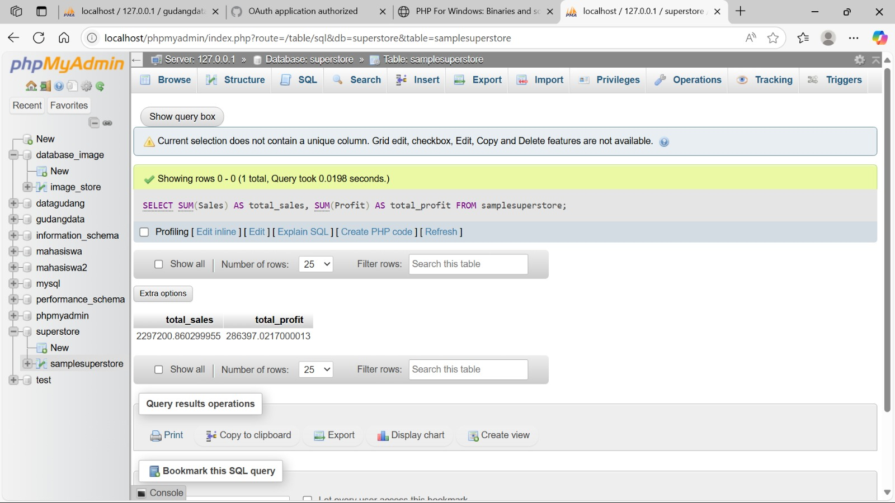
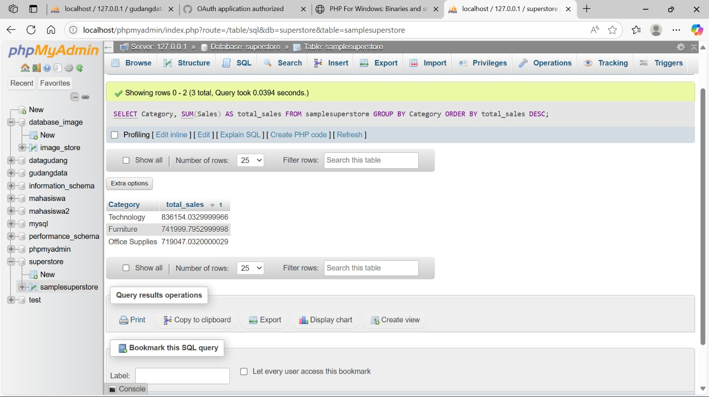
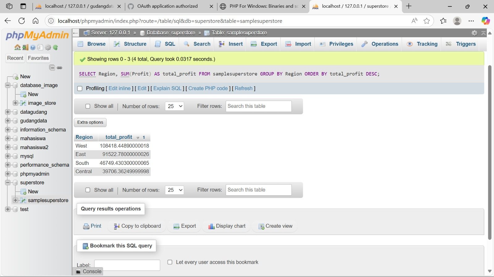
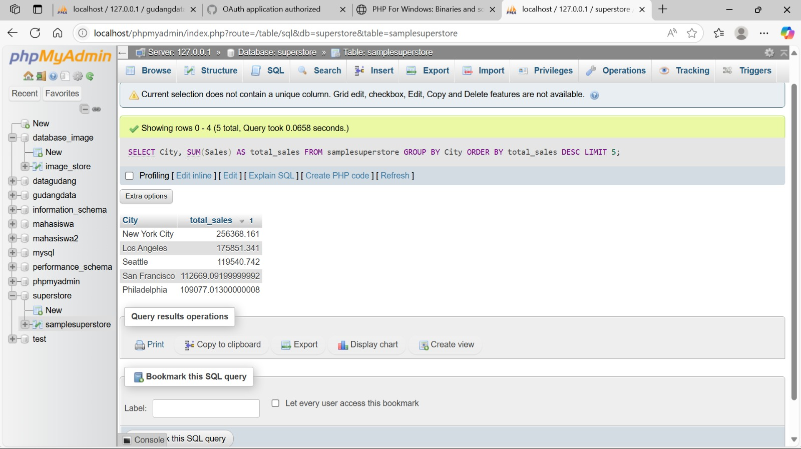

# Data Warehouse Dalam Industri Retail

## 📊 Dataset Overview
Proyek ini menganalisis dataset Superstore dari Kaggle, dengan fokus pada kinerja penjualan, perilaku pelanggan, dan wawasan bisnis untuk jaringan superstore ritel.

**Dataset Source**: [Kaggle - Superstore Dataset](https://www.kaggle.com/datasets/roopacalistus/superstore)

---

## 1. Ringkasan Proyek dan Latar Belakang

### Latar Belakang
Superstore merupakan salah satu retailer terbesar yang menjual berbagai produk mulai dari furniture, office supplies, hingga technology. Dengan pertumbuhan bisnis yang pesat, perusahaan membutuhkan analisis mendalam terhadap data penjualan untuk mengoptimalkan strategi bisnis dan meningkatkan profitabilitas.

### Permasalahan Bisnis
- Bagaimana tren penjualan dan profitabilitas di berbagai kategori produk?
- Siapa customer segment yang paling menguntungkan?
- Wilayah mana yang memberikan kontribusi revenue tertinggi?
- Produk apa yang perlu difokuskan atau dihentikan?

### Objektif Proyek
- Menganalisis performa penjualan berdasarkan kategori, region, dan customer segment
- Mengidentifikasi produk dan customer yang paling profitable
- Memberikan rekomendasi strategis untuk meningkatkan profitabilitas
- Membangun dashboard interaktif untuk monitoring KPI

---

## 2. Tujuan dan Ruang Lingkup Sistem

### Tujuan Utama
1. **Analisis Deskriptif**: Memahami pola penjualan historis dan tren bisnis
2. **Analisis Profitabilitas**: Mengidentifikasi produk dan segmen yang paling menguntungkan
3. **Segmentasi Customer**: Mengelompokkan customer berdasarkan behavior pembelian
4. **Forecasting**: Memprediksi tren penjualan untuk periode mendatang
5. **Dashboard Development**: Membangun visualisasi interaktif untuk stakeholder

### Ruang Lingkup
- **Data Temporal**: 2014-2017 (4 tahun data penjualan)
- **Geografis**: United States (3 regions, 49 states, 531 cities)
- **Produk**: 3 kategori utama (Furniture, Office Supplies, Technology)
- **Customer**: 3 segmen (Consumer, Corporate, Home Office)

---

## 3. Metodologi

### Tools dan Teknologi
- **Storage**: MySQL/PostgreSQL database
- **Processing**: SQL queries dan Excel/Google Sheets
- **Analytics**: SQL untuk data analysis
- **Visualization**: Tableau Desktop/Public
- **Data Import**: CSV import ke SQL database

### Tahapan Analisis

#### **Misi 1: Analisis Kebutuhan & Pemecahan Masalah**
- Identifikasi stakeholder utama dan tujuan bisnis
- Analisis kebutuhan informasi setiap divisi
- Penentuan metrik kunci (fakta) dan dimensi
- Pemecahan masalah bisnis melalui pendekatan data-driven

#### **Misi 2: Desain Konseptual**
- Perancangan model dimensional (star schema/snowflake)
- Identifikasi fact table dan dimension table
- Penentuan grain level dan hierarchy dimensi
- Pemodelan hubungan antar tabel

#### **Misi 3: Desain Logikal & Fisik**
- Transformasi model konseptual ke struktur database
- Optimalisasi struktur tabel dan indexing
- Penentuan tipe data dan constraint
- Desain ETL (Extract, Transform, Load) process

#### **Misi 4: Implementasi, Reporting, & Produksi**
- Implementasi data warehouse di environment produksi
- Pengembangan dashboard dan laporan bisnis
- Testing dan validasi data quality
- Deployment dan maintenance system

---

## 4. Analisis Kebutuhan (Misi 1)
Analisis kebutuhan berfokus pada identifikasi stakeholder utama dan tujuan bisnis mereka dalam konteks analisis data superstore. Dari sini, ditentukan metrik (fakta) dan konteks (dimensi) yang krusial untuk data warehouse.

## Stakeholder Utama & Tujuan Bisnis Kunci:

### 🏢 **CEO**
- Memastikan pertumbuhan bisnis dan profitabilitas menyeluruh
- Mengidentifikasi peluang ekspansi pasar dan segmen baru
- Menentukan strategi kompetitif berdasarkan performa regional

### 👨‍💼 **Manajer Umum**
- Merencanakan, mengarahkan, dan mengelola operasi bisnis secara menyeluruh
- Mengoptimalkan efisiensi operasional dan alokasi sumber daya
- Memantau kinerja seluruh divisi dan mengidentifikasi area perbaikan

### 💰 **Tim Keuangan**
- Mengoptimalkan profitabilitas dan kontrol biaya operasional
- Menganalisis margin keuntungan per produk, kategori, dan wilayah
- Mengelola anggaran dan mengidentifikasi peluang penghematan

### 📊 **Tim Pemasaran**
- Meningkatkan konversi penjualan dan retensi pelanggan
- Menganalisis efektivitas strategi pemasaran per segmen
- Menyesuaikan penawaran produk ke wilayah dan kelompok pelanggan tertentu

### 🚚 **Tim Logistik**
- Meminimalkan stok berlebih dan kekurangan stok
- Mengoptimalkan distribusi dan pengiriman berdasarkan wilayah
- Mengelola inventory berdasarkan pola penjualan historis

### 📈 **Tim Analisis Data**
- Menyediakan *insights* bisnis dan analisis prediktif
- Membuat segmentasi pelanggan dan analisis perilaku konsumen
- Mengidentifikasi tren penjualan dan pola musiman

## Fakta Utama yang Diidentifikasi:
- **Sales** (Nilai Penjualan)
- **Quantity** (Jumlah Unit Terjual)
- **Discount** (Diskon yang Diberikan)
- **Profit** (Keuntungan Bersih)

## Dimensi Utama yang Diidentifikasi:
- **DimCustomer** (Segmen Pelanggan)
- **DimProduct** (Kategori, Sub-Kategori Produk)
- **DimGeography** (Negara, State, Kota, Region, Kode Pos)
- **DimShipMode** (Mode Pengiriman)
---

## 5. Desain Konseptual, Logikal, dan Fisikal (Misi 2 & 3)
Pendekatan Star Schema diterapkan dalam perancangan data warehouse untuk memaksimalkan kinerja analisis data dan kemudahan navigasi struktur informasi.



### Desain Konseptual

**Fact Tables**:
- **fakta_sales**: Tabel utama yang menyimpan data penjualan

**Dimension Tables**:
- **dim_location**: Data lokasi (country, city, state, region, postal_code)
- **dim_customer**: Data pelanggan (customer_id, segment)
- **dim_product**: Data produk (product_id, category, sub_category)
- **dim_time**: Data waktu (time_id, year, month, day)
  
### Desain Logikal

**Relasi Tabel**:
- **Semua dimension tables** terhubung ke **fact table** melalui foreign keys
- Menggunakan model **star schema** untuk optimasi query analytical

### Desain Fisikal
Desain fisikal pada data warehouse Superstore menerapkan strategi pengindeksan (indexing) yang optimal untuk meningkatkan performa query, terutama untuk operasi yang melibatkan penyaringan (WHERE), penggabungan tabel (JOIN), dan pengelompokan data (GROUP BY). Index berperan krusial dalam mempercepat akses data, mengurangi waktu eksekusi query, dan meningkatkan efisiensi sistem secara keseluruhan, terutama ketika menangani volume data yang besar. 

### Rasionalisasi Pemilihan Kolom Index

- **`Customer_ID`**:  
  Mempercepat join dengan tabel `dim_customer` untuk analisis:
  - Segmentasi pelanggan
  - Analisis RFM (Recency, Frequency, Monetary)
  - Analisis loyalitas pelanggan

- **`Product_ID`**:  
  Dioptimalkan untuk query terkait kinerja produk seperti:
  - `"produk terlaris"`
  - `"analisis margin per item"`

- **`Region` dan `Category` (Composite Index)**:  
  Mendukung query multidimensi seperti:
  - `"penjualan kategori Furniture di Region Barat"`
---

## 6. Proses Implementasi (Misi 4)
1. memasukkan data
    proses ini merupakan tahap awal dari pembangunan awal dalam data warehouse
   data ini mencakup pelanggan, informasi geografis, kategori produk, serta metrik bisnis utama seperti pengiriman, diskon, dan profit.



Hasil: Pada tahap ekstraksi, data mentah dari Superstore yang tersimpan dalam format CSV diproses. Data yang diekstrak mencakup berbagai dimensi penting seperti segmentasi pelanggan, informasi geografis, kategori produk, serta metrik bisnis utama seperti pengiriman, diskon, dan profit. 



2. Mengembangkan Scrit PHP untuk Melakukan Proses ETL(Extract,Transform,Load)
   pengembangan ini dimulai dari koneksi ke database, pembacaan file CSV, hingga load data pengembangan ini merupakan tahap awal integrasi data dari sumber eksternal
   


3. Analisis Data
   1. OLAP (Online Analytical Processing)
      Agregasi Data
      tahap ini bertujuan untuk melihat gambaran umum dari peforma bisnis. dimana performa bisnis dinilai dari jumlah keuntungan dan jumlah profit yang dihasilkan.

      
berdasarkan jumlah keuntungan dan jumlah profit
      
total profit berdasarkan kategori
      
total profit berdasarkan wilayah
 
total profit berdasarkan kota
 
---

## 7. Hasil Implementasi


---

## 8. Evaluasi


---

# 9. Rencana Pengembangan ke Depan

## **Perbaikan Jangka Pendek (3 bulan)**
- **Enhanced SQL Analytics**:  
  Mengembangkan stored procedure untuk perhitungan kompleks seperti:  
  ✅ Customer lifetime value  
  ✅ Tren profitabilitas produk  

---

## **Tujuan Jangka Menengah (6-12 bulan)**  
- **Analisis Musiman**:  
  Kueri SQL untuk identifikasi:  
  🍂 Tren seasonal berdasarkan ship mode  
  🗺️ Pola regional  

- **Segmentasi Pelanggan**:  
  Analisis RFM lanjutan dengan SQL untuk:  
  🎯 Target pelanggan lebih akurat berdasarkan perilaku segment  

---

## **Visi Jangka Panjang (1-2 tahun)**  
- **Integrasi Prediktif Analytics**:  
  Model forecasting dasar di Excel untuk:  
  🔮 Prediksi penjualan berdasarkan tren historis  

- **Sistem Pelaporan Otomatis**:  
  Pembuatan:  
  ⏰ Laporan Tableau terjadwal untuk review bisnis bulanan  

---

## 10. Tim Proyek

- Marhanny Zahra Nurendra 	120450017
- Eunike Bunga Santa		121450095
- Muhammad Bayu Syuhada	122450007
- Johannes Krisjon Silitonga	122450043
- Rian Bintang Wijaya		122450094
- Bastian Heskia Silaban	122450130

---

## 📁 Project Structure
```
superstore-analysis/
├── data/
│   ├── raw/
│   │   └── superstore.csv
│   ├── processed/
│   │   └── cleaned_superstore.csv
│   └── sql/
│       └── database_schema.sql
├── excel_analysis/
│   ├── data_exploration.xlsx
│   ├── pivot_analysis.xlsx
│   └── summary_report.xlsx
├── sql_queries/
│   ├── basic_analysis.sql
│   ├── advanced_queries.sql
│   └── kpi_calculations.sql
├── tableau/
│   ├── superstore_dashboard.twb
│   ├── executive_summary.twb
│   └── detailed_analysis.twb
└── documentation/
    ├── data_dictionary.xlsx
    └── user_guide.pdf
```
